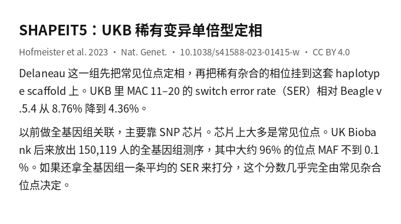

# paper-reading

Homemade Cursor skill. One research PDF to one Chinese L3 illustrated note.

自制 Cursor 技能。一篇研究 PDF，写成一篇中文三级带图笔记。

Pipeline: extract → crop → SI inventory → English draft → Chinese guide → excerpts → lint.

流程：抽取 → 裁图 → SI 清单 → 英文草稿 → 中文导读 → 摘句 → 检查。

This repository is the shareable skill. Your PDF library stays on your machine.

本仓库只分享技能。PDF 库留在你自己的机器上。

## Example / 案例

**SHAPEIT5** — [full case](examples/2023-hofmeister-shapeit5/README.md)

Hofmeister et al. 2023, *Nature Genetics* ([10.1038/s41588-023-01415-w](https://doi.org/10.1038/s41588-023-01415-w), CC BY 4.0). Rare-variant phasing on UK Biobank WGS/WES.

Hofmeister 等 2023。UK Biobank WGS/WES 上的稀有变异定相。



Chinese L3 note only. Journal figure crops and the PDF are not in this repo.

只放中文 L3 笔记。期刊图和 PDF 不进仓库。

## Install / 安装

Do **not** symlink the folder into `~/.cursor/skills/` (the skill sets `disable-model-invocation: true`; a symlink plus commands would list it twice).

不要把目录软链到 `~/.cursor/skills/`（技能开了 `disable-model-invocation: true`，再加 command 会列两次）。

```bash
git clone https://github.com/Xuzhen-Li/paper-reading.git
PKG="$(pwd)/paper-reading/paper-reading"
mkdir -p ~/.cursor/commands
sed "s|{{SKILL_DIR}}|$PKG|g" "$PKG/commands/paper-reading.md" > ~/.cursor/commands/paper-reading.md
sed "s|{{SKILL_DIR}}|$PKG|g" "$PKG/commands/精读.md" > ~/.cursor/commands/精读.md
```

Copy `paper-reading/config.example.yml` to `paper-reading/config.yml`, or set:

把 `paper-reading/config.example.yml` 复制为 `config.yml`，或设置：

```bash
export PAPER_LIB_DIR=/path/to/pdf-library   # read-only
export NOTES_DIR=/path/to/notes
export FIGURES_DIR=/path/to/notes/_figures
export TMP_DIR=/path/to/tmp
```

## Use / 用法

New agent chat, attach a PDF (or a path / DOI):

新开 Agent 对话，附上 PDF（或路径 / DOI）：

```text
/paper-reading
```

```text
/paper-reading polish 2026-some-note.md
```

Rules / 规则：

1. `PAPER_LIB_DIR` is read-only. / `PAPER_LIB_DIR` 只读。
2. Notes are new markdown in `NOTES_DIR`. Same DOI already present → stop, unless you named that file. / 笔记写到 `NOTES_DIR`。同一 DOI 已有笔记就停，除非你点名了那个文件。
3. Crops only under `FIGURES_DIR/<slug>/`. / 裁图只放 `FIGURES_DIR/<slug>/`。
4. After every write / 每次写完后：

```bash
python3 "$PKG/scripts/audit_note_prose.py" "$NOTE" --strict
```

Do not run WeChat or HTML skills on the note in place. Copy it first.

不要对原笔记直接跑微信或 HTML 技能。先复制一份。

Full steps: [USAGE.md](USAGE.md). Agent entry: [paper-reading/SKILL.md](paper-reading/SKILL.md).

完整步骤见 [USAGE.md](USAGE.md)。入口见 [paper-reading/SKILL.md](paper-reading/SKILL.md)。

## License / 许可

MIT for the skill. The example note discusses a CC BY 4.0 paper; figure files are not redistributed here.

技能 MIT。案例讨论的是 CC BY 4.0 论文；图文件不在此再分发。
