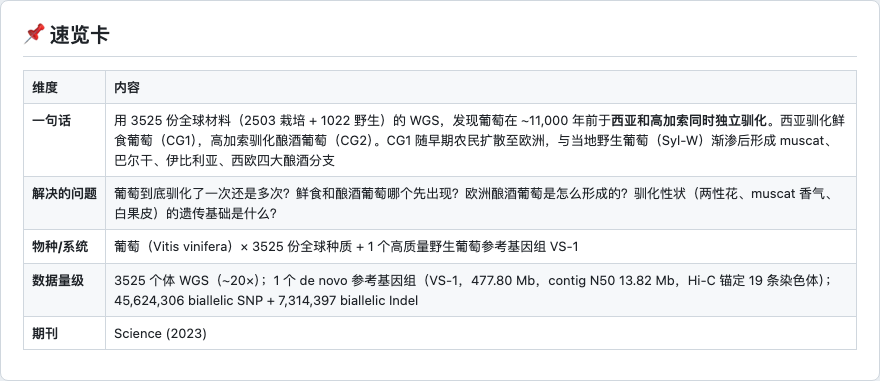
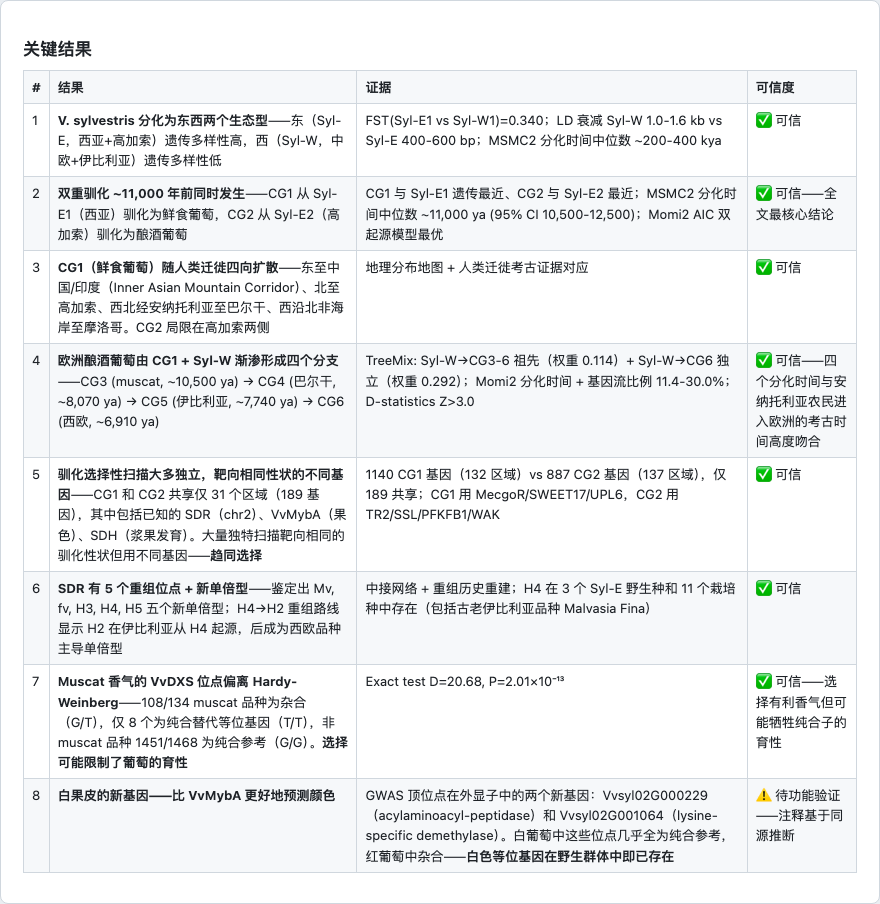
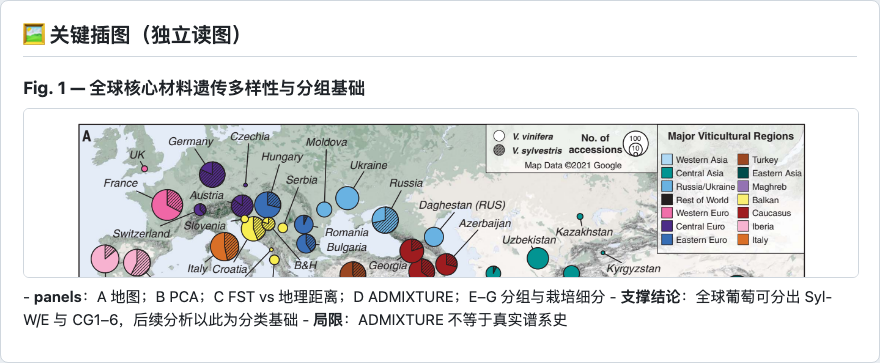
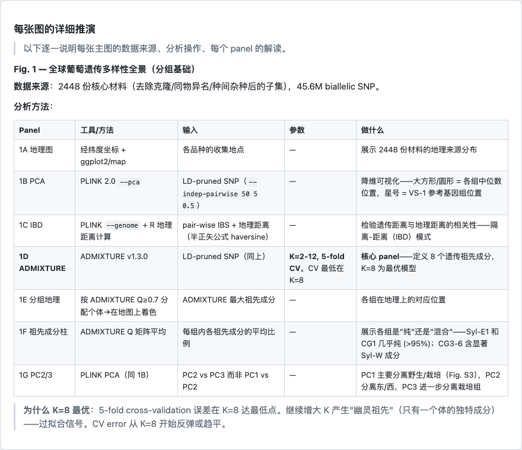
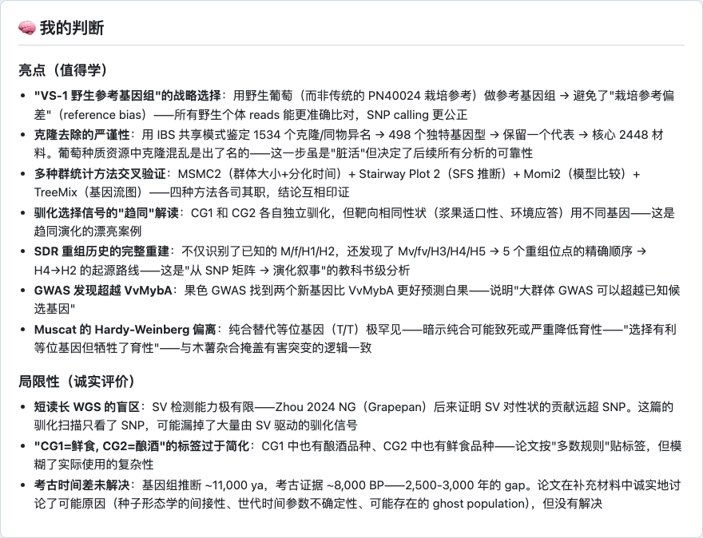
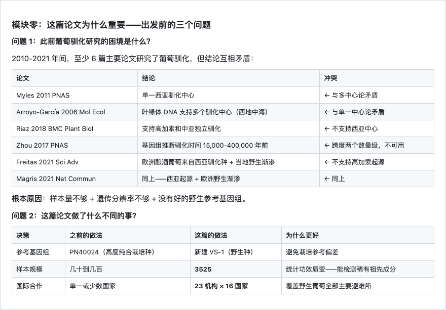
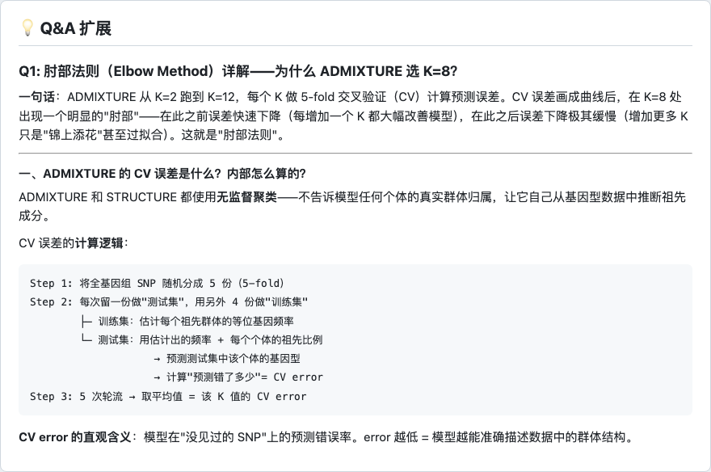
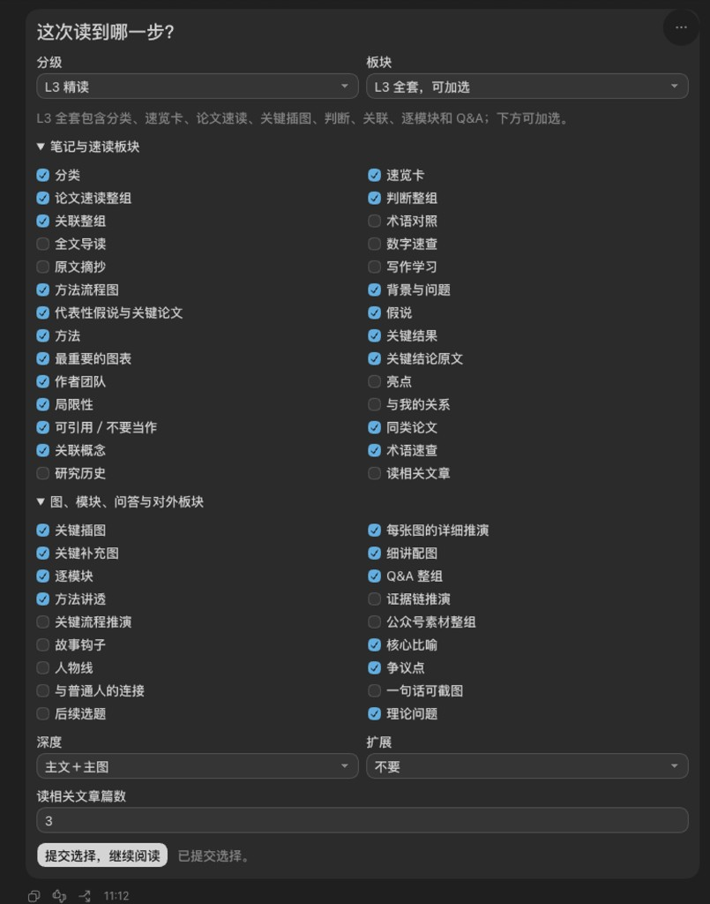

# paper-reading

[](examples/2023-dong-grapevine-dual-domestication/note.md)
[](examples/2023-dong-grapevine-dual-domestication/note.md)

下面是主案例笔记渲染之后的板块，不是期刊 PDF 的整页截图。完整笔记在 [note.md](examples/2023-dong-grapevine-dual-domestication/note.md)。图里若出现 Fig. 1，用的是笔记已有的正文裁切，来源见 [SOURCES.md](examples/2023-dong-grapevine-dual-domestication/figures/SOURCES.md)。

The pictures below are sections of the rendered demo note, not a journal-page crop. Full note: [note.md](examples/2023-dong-grapevine-dual-domestication/note.md).















## 中文

把一篇研究 PDF，写成一篇**中文带图阅读笔记**。PDF 库留在本机，不会上传到这个仓库。

斜杠命令是 `/paper-reading` 或 `/精读`。能读本仓 `paper-reading/SKILL.md`、又能跑本仓 Python 脚本的代理，按同一套步骤即可；不为个别产品另做安装器。细则见 [USAGE.md](USAGE.md) 与 `paper-reading/SKILL.md`。

打开 PDF 之前先交这张选项卡，标题是「这次读到哪一步？」。分级、板块、深度、扩展是下拉。板块选「L3 全套，可加选」时，全套先包含分类、速览卡、论文速读、关键插图、判断、关联、逐模块和 Q&A，下面两组勾选是在这套之上加写。没勾的不写。读相关文章单独填篇数。点「提交选择，继续阅读」之后才开始读。下图是一次已提交的选择，图里的勾属于那一次，不是默认状态。



**笔记与速读板块**：分类、速览卡、论文速读整组、判断整组、关联整组、术语对照、全文导读、数字速查、原文摘抄、写作学习、方法流程图、背景与问题、代表性假说与关键论文、假说、方法、关键结果、最重要的图表、关键结论原文、作者团队、亮点、局限性、与我的关系、可引用 / 不要当作、同类论文、关联概念、术语速查、研究历史、读相关文章。

**图、模块、问答与对外板块**：关键插图、每张图的详细推演、关键补充图、细讲配图、逐模块、Q&A 整组、方法讲透、证据链推演、关键流程推演、公众号素材整组、故事钩子、核心比喻、人物线、争议点、与普通人的连接、一句话可截图、后续选题、理论问题。

深度是主文 + 主图、只读主文、再加会改主张的补充材料。扩展是不要、只抽图、润色措辞、润色核数字。上图提交的是「主文 + 主图」和「不要」，读相关文章篇数是 3。消息里写「按默认」，或板块选 L3 全套，写入分类、速览卡、论文速读整组、关键插图、判断整组、关联整组、逐模块、Q&A。

Claude Code 仍用 `AskUserQuestion`：先问分级和深度，其余在读的过程中问。

**逐模块**没有固定名单。要先读完这篇 PDF，再另开一张选项卡，标题是「这篇的模块，写哪些？」。选项来自本篇结果链，不要套用 Dong 2023 或其他笔记的模块标题。

细讲配图用 `scripts/mark_figure_detail.py`：裁到正在讲的那一小块，标注写在副本上，**不覆盖** `fig0N.png`。这些裁切单独写成 `## 小图精讲`，大纲里要能看到每一块。图下那句斜体说明里不要再套一对斜体，否则预览会把后面的图吃掉。`audit_note_prose.py --strict` 会检查这件事。

### 安装

```bash
git clone https://github.com/Xuzhen-Li/paper-reading.git
cd paper-reading
PKG="$(pwd)/paper-reading"
mkdir -p ~/.cursor/commands
sed "s|{{SKILL_DIR}}|$PKG|g" "$PKG/commands/paper-reading.md" > ~/.cursor/commands/paper-reading.md
sed "s|{{SKILL_DIR}}|$PKG|g" "$PKG/commands/精读.md" > ~/.cursor/commands/精读.md
```

```bash
export PAPER_LIB_DIR=/path/to/pdf-library   # read-only
export NOTES_DIR=/path/to/notes
export FIGURES_DIR=/path/to/notes/_figures
export TMP_DIR=/path/to/tmp
```

```text
/paper-reading
```

```text
/paper-reading 润色 2026-some-note.md
```

```bash
python3 "$PKG/scripts/audit_note_prose.py" "$NOTE" --strict
```

### 案例

- **主案例**：[Dong 等 2023 葡萄双重驯化](examples/2023-dong-grapevine-dual-domestication/README.md) — 打开 [note.md](examples/2023-dong-grapevine-dual-domestication/note.md)。首页图是这篇笔记渲染后的板块。
- **次案例**：[Hofmeister 等 2023 SHAPEIT5](examples/2023-hofmeister-shapeit5/README.md) — 只链自制示意 [scaffold-and-ser.png](examples/2023-hofmeister-shapeit5/figures/scaffold-and-ser.png)。

## English

Turns **one research PDF** into a **Chinese illustrated reading note**. Your PDF library stays on your machine; this repo does not host it.

Slash commands: `/paper-reading` or `/精读`. Any agent that can read `paper-reading/SKILL.md` and run this repo’s Python scripts follows the same steps. There is no separate installer for other products. Details: [USAGE.md](USAGE.md) and `paper-reading/SKILL.md`.

Before the PDF, submit the option card titled 这次读到哪一步？. Level, section preset, depth, and extra are dropdowns. The preset 「L3 全套，可加选」 already includes classification, the skim card, the paper skim, key figures, judgment, related notes, modules, and Q&A. The two checkbox groups add sections on top of that set. Unticked boxes are not written. Related-article count is its own field. Reading starts after 提交选择，继续阅读. The figure is one submitted selection; the ticks belong to that run, not to the default.


**Note and skim**: classification, skim card, paper-skim group, judgment group, related group, term map, full walkthrough, number lookup, excerpts, writing craft, methods flowchart, background, hypothesis timeline, hypothesis, methods, key results, most important figures, key conclusion quotes, authors, highlights, limits, relevance to me, citable / do-not-treat-as, related papers, related concepts, term lookup, research history, read related articles.

**Figures, modules, Q&A, and outreach**: key figures, per-figure walkthrough, key supplement figures, detail crops, modules, Q&A group, methods explained, evidence-chain walkthrough, pipeline walkthrough, WeChat-material group, story hook, central metaphor, people, dispute, link to a general reader, one screenshot line, follow-up topics, open theory questions.

Depth is main text plus main figures, main text only, or claim-changing supplements. Extra is none, crops only, polish wording, or polish against the PDF numbers. The figure above submitted 「主文 + 主图」 and 「不要」, with related-article count 3. The words `按默认`, or the L3-full preset, write classification, the skim card, the paper-skim group, key figures, the judgment group, the related group, modules, and Q&A.

Claude Code still uses `AskUserQuestion`: level and depth first, then later questions while reading.

**Modules** have no fixed list. Finish reading this PDF first, then open a second card titled `这篇的模块，写哪些？`. Options come from this paper’s result chain; do not reuse Dong 2023 or another note’s module titles.

Detail figures use `scripts/mark_figure_detail.py`: crop to the small region under discussion, put marks on a **copy**, and **never overwrite** `fig0N.png`. Those crops get their own `## 小图精讲` heading so each panel shows in the outline. Do not nest another `*...*` inside that italic caption; the preview then hides the following image. `audit_note_prose.py --strict` checks this.

### Install

```bash
git clone https://github.com/Xuzhen-Li/paper-reading.git
cd paper-reading
PKG="$(pwd)/paper-reading"
mkdir -p ~/.cursor/commands
sed "s|{{SKILL_DIR}}|$PKG|g" "$PKG/commands/paper-reading.md" > ~/.cursor/commands/paper-reading.md
sed "s|{{SKILL_DIR}}|$PKG|g" "$PKG/commands/精读.md" > ~/.cursor/commands/精读.md
```

```bash
export PAPER_LIB_DIR=/path/to/pdf-library   # read-only
export NOTES_DIR=/path/to/notes
export FIGURES_DIR=/path/to/notes/_figures
export TMP_DIR=/path/to/tmp
```

```text
/paper-reading
```

```text
/paper-reading 润色 2026-some-note.md
```

```bash
python3 "$PKG/scripts/audit_note_prose.py" "$NOTE" --strict
```

### Examples

- **Primary**: [Dong et al. 2023 grapevine dual domestication](examples/2023-dong-grapevine-dual-domestication/README.md) — open [note.md](examples/2023-dong-grapevine-dual-domestication/note.md). The pictures at the top of this page are rendered sections of that note.
- **Secondary**: [Hofmeister et al. 2023 SHAPEIT5](examples/2023-hofmeister-shapeit5/README.md) — link only the original schematic [scaffold-and-ser.png](examples/2023-hofmeister-shapeit5/figures/scaffold-and-ser.png).
