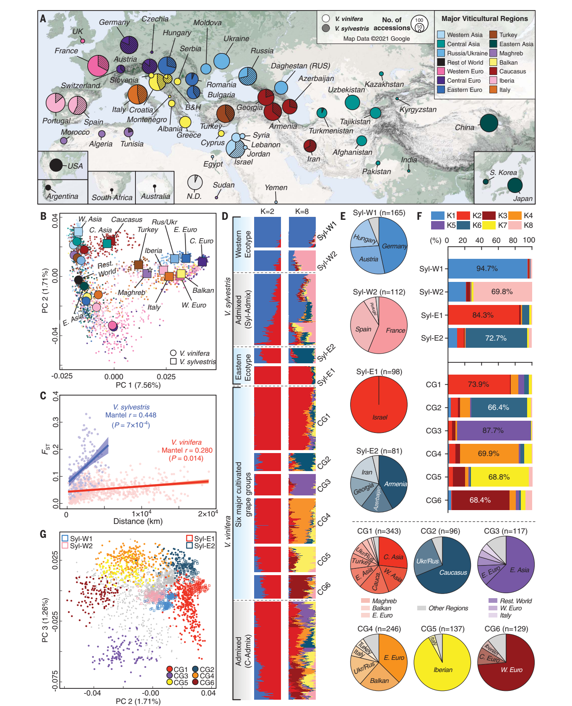

# paper-reading

[](examples/2023-dong-grapevine-dual-domestication/note.md)
[](examples/2023-dong-grapevine-dual-domestication/note.md)



*上图来自主案例笔记里的正文裁切（`fig01.png`），不是新裁的期刊图。授权与来源见 [examples/2023-dong-grapevine-dual-domestication/figures/SOURCES.md](examples/2023-dong-grapevine-dual-domestication/figures/SOURCES.md)。*

## 中文

把一篇研究 PDF，写成一篇**中文带图阅读笔记**。PDF 库留在本机，不会上传到这个仓库。

斜杠命令是 `/paper-reading` 或 `/精读`。能读本仓 `paper-reading/SKILL.md`、又能跑本仓 Python 脚本的代理，按同一套步骤即可；不为个别产品另做安装器。细则见 [USAGE.md](USAGE.md) 与 `paper-reading/SKILL.md`。

开始前会弹出**选项卡**。没勾选的板块不写。消息里写「按默认」等于选 L3 全套。五道题依次是：

1. **分级**：L3 精读 / L2 标准 / L1 速览。
2. **板块·笔记与速读**（可多选）：`按默认：L3 全套`，以及分类、速览卡、论文速读整组、判断整组、关联整组、术语对照、全文导读、数字速查、摘抄、写作学习、方法流程图、背景与问题、代表性假说与关键论文、假说、方法、关键结果、最重要的图表、关键结论原文、作者团队、亮点、局限性、与我的关系、可引用 / 不要当作、同类论文、关联概念、术语速查、研究历史、读相关文章等。
3. **板块·图、模块、问答与对外**（可多选）：关键插图、每张图的详细推演、关键补充图、细讲配图、逐模块、Q&A 整组与分题、公众号素材整组与小块、后续选题、理论问题等。
4. **深度**：主文+主图 / 只读主文 / 再加会改主张的补充材料。
5. **扩展**：不要 / 只抽图 / 润色措辞 / 润色核数字。

「按默认」写入的板块是：分类、速览卡、论文速读整组、关键插图、判断整组、关联整组、逐模块、Q&A。没勾就不写，即使分级是 L3。

**逐模块**没有固定名单。要先读完这篇 PDF，再另开一张选项卡，标题是「这篇的模块，写哪些？」。选项来自本篇结果链，不要套用 Dong 2023 或其他笔记的模块标题。

细讲配图用 `scripts/mark_figure_detail.py`：裁到正在讲的那一小块，标注写在副本上，**不覆盖** `fig0N.png`。这些裁切单独写成 `## 小图精讲`，大纲里要能看到每一块。图下那句斜体说明里不要再套一对斜体，否则预览会把后面的图吃掉。`audit_note_prose.py --strict` 会检查这件事。

### 安装

```bash
git clone https://github.com/Xuzhen-Li/paper-reading.git
cd paper-reading
PKG="$(pwd)/paper-reading"
mkdir -p ~/.cursor/commands
sed "s|{{SKILL_DIR}}|$PKG|g" "$PKG/commands/paper-reading.md" > ~/.cursor/commands/paper-reading.md
sed "s|{{SKILL_DIR}}|$PKG|g" "$PKG/commands/精读.md" > ~/.cursor/commands/精读.md
```

```bash
export PAPER_LIB_DIR=/path/to/pdf-library   # read-only
export NOTES_DIR=/path/to/notes
export FIGURES_DIR=/path/to/notes/_figures
export TMP_DIR=/path/to/tmp
```

```text
/paper-reading
```

```text
/paper-reading 润色 2026-some-note.md
```

```bash
python3 "$PKG/scripts/audit_note_prose.py" "$NOTE" --strict
```

### 案例

- **主案例**：[Dong 等 2023 葡萄双重驯化](examples/2023-dong-grapevine-dual-domestication/README.md) — 打开 [note.md](examples/2023-dong-grapevine-dual-domestication/note.md)（含 Fig. 1–6 正文裁切图）。
- **次案例**：[Hofmeister 等 2023 SHAPEIT5](examples/2023-hofmeister-shapeit5/README.md) — 只链自制示意 [scaffold-and-ser.png](examples/2023-hofmeister-shapeit5/figures/scaffold-and-ser.png)。

## English

Turns **one research PDF** into a **Chinese illustrated reading note**. Your PDF library stays on your machine; this repo does not host it.

Slash commands: `/paper-reading` or `/精读`. Any agent that can read `paper-reading/SKILL.md` and run this repo’s Python scripts follows the same steps. There is no separate installer for other products. Details: [USAGE.md](USAGE.md) and `paper-reading/SKILL.md`.

Before work starts, an **option card** appears. Unticked sections are not written. The words `按默认` mean the L3 full set. The five questions are:

1. **Level**: L3 deep read / L2 standard / L1 skim.
2. **Sections · note & skim** (multi-select): `按默认：L3 full set`, plus classification, skim card, paper-skim group, judgment group, related group, term map, full walkthrough, number lookup, excerpts, writing craft, methods flowchart, background, hypothesis timeline, hypothesis, methods, key results, most important figures, key conclusion quotes, authors, highlights, limits, relevance to me, citable / do-not-treat-as, related papers, related concepts, term lookup, research history, read related articles, and more.
3. **Sections · figures, modules, Q&A & outreach** (multi-select): key figures, per-figure deep walkthrough, key SI figures, detail crops with marks, module-by-module, Q&A group and splits, WeChat-material group and pieces, follow-up topics, open theory questions, and more.
4. **Depth**: main text + main figures / main text only / also claim-changing SI.
5. **Extra**: none / crops only / polish wording / polish against PDF numbers.

`按默认` writes: classification, skim card, paper-skim group, key figures, judgment group, related group, modules, and Q&A. Unticked cards stay unwritten even on L3.

**Modules** have no fixed list. Finish reading this PDF first, then open a second card titled `这篇的模块，写哪些？`. Options come from this paper’s result chain; do not reuse Dong 2023 or another note’s module titles.

Detail figures use `scripts/mark_figure_detail.py`: crop to the small region under discussion, put marks on a **copy**, and **never overwrite** `fig0N.png`. Those crops get their own `## 小图精讲` heading so each panel shows in the outline. Do not nest another `*...*` inside that italic caption; the preview then hides the following image. `audit_note_prose.py --strict` checks this.

### Install

```bash
git clone https://github.com/Xuzhen-Li/paper-reading.git
cd paper-reading
PKG="$(pwd)/paper-reading"
mkdir -p ~/.cursor/commands
sed "s|{{SKILL_DIR}}|$PKG|g" "$PKG/commands/paper-reading.md" > ~/.cursor/commands/paper-reading.md
sed "s|{{SKILL_DIR}}|$PKG|g" "$PKG/commands/精读.md" > ~/.cursor/commands/精读.md
```

```bash
export PAPER_LIB_DIR=/path/to/pdf-library   # read-only
export NOTES_DIR=/path/to/notes
export FIGURES_DIR=/path/to/notes/_figures
export TMP_DIR=/path/to/tmp
```

```text
/paper-reading
```

```text
/paper-reading 润色 2026-some-note.md
```

```bash
python3 "$PKG/scripts/audit_note_prose.py" "$NOTE" --strict
```

### Examples

- **Primary**: [Dong et al. 2023 grapevine dual domestication](examples/2023-dong-grapevine-dual-domestication/README.md) — open [note.md](examples/2023-dong-grapevine-dual-domestication/note.md) (cropped Fig. 1–6 from the article body).
- **Secondary**: [Hofmeister et al. 2023 SHAPEIT5](examples/2023-hofmeister-shapeit5/README.md) — link only the original schematic [scaffold-and-ser.png](examples/2023-hofmeister-shapeit5/figures/scaffold-and-ser.png).
