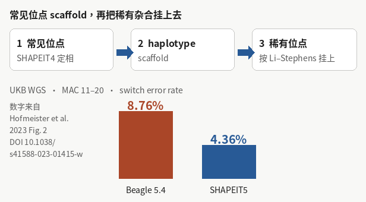

# paper-reading

## 中文

把一篇研究 PDF，写成一篇**中文带图阅读笔记**。

这是 [Cursor](https://cursor.com) Agent 斜杠命令技能（`/paper-reading`）。**L3** 指全文导读，不是短摘要卡片。PDF 库留在本机。规则与细节见 [USAGE.md](USAGE.md)。

## English

Cursor skill that turns **one research PDF** into a **Chinese illustrated reading note**.

[Cursor](https://cursor.com) Agent slash-command skill (`/paper-reading`). **L3** means a full guided walkthrough, not a short abstract card. Your PDF library stays on your machine. Rules and detail: [USAGE.md](USAGE.md).

## 安装 / Install

```bash
git clone https://github.com/Xuzhen-Li/paper-reading.git
cd paper-reading
PKG="$(pwd)/paper-reading"
mkdir -p ~/.cursor/commands
sed "s|{{SKILL_DIR}}|$PKG|g" "$PKG/commands/paper-reading.md" > ~/.cursor/commands/paper-reading.md
sed "s|{{SKILL_DIR}}|$PKG|g" "$PKG/commands/精读.md" > ~/.cursor/commands/精读.md
```

```bash
export PAPER_LIB_DIR=/path/to/pdf-library   # read-only
export NOTES_DIR=/path/to/notes
export FIGURES_DIR=/path/to/notes/_figures
export TMP_DIR=/path/to/tmp
```

```text
/paper-reading
```

```text
/paper-reading 润色 2026-some-note.md
```

```bash
python3 "$PKG/scripts/audit_note_prose.py" "$NOTE" --strict
```

## 首页示意 / Home figure



次案例自制示意（scaffold / SER），不是 Dong 2023 的期刊原图，也不是 *Science* 图。

Secondary-example original schematic (scaffold / SER). Not a Dong 2023 journal figure, and not a *Science* figure.

## 案例 / Examples

- [Dong 等 2023 葡萄双重驯化](examples/2023-dong-grapevine-dual-domestication/README.md) — **主案例** / primary（含 Fig. 1–6 裁切图）
- [Hofmeister 等 2023 SHAPEIT5](examples/2023-hofmeister-shapeit5/README.md) — **次案例** / secondary
